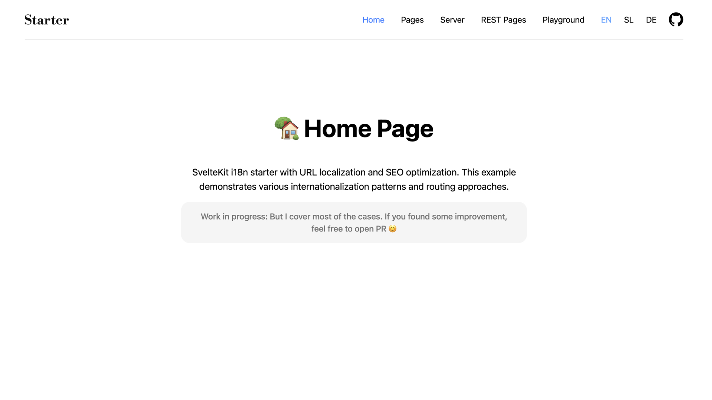

# 🌍 SvelteKit i18n Starter


**Keywords:** `sveltekit` • `svelte` • `i18n` • `internationalization` • `multilingual` • `url localization` • `seo` • `tailwind css`

## 🌐 [Live Demo](https://sveltekit-i18n-starter.klemenc.dev)

URL‑driven localization for SvelteKit (v2.38+). Clean slugs, strict mapping under `routes/[lang=lang]`, zero cookies, and a single source of truth for languages.

## 🚀 Features

-   Data‑only slug mapping in `src/i18n/routes.js`
-   Pure JS routing helpers in `src/i18n/routing.js`
-   Auto‑loaded JSON translations + Svelte context in `src/i18n/i18n.js`
-   Languages registry in `src/i18n/languages.js` (single source of truth)
-   Default language at root (no prefix) by default, with optional prefix mode
-   Strict validation only inside `routes/[lang=lang]` (root endpoints untouched)
-   Multi‑segment placeholders with `{...rest}` in slug mappings
-   Built‑in playground pages: `/playground/api` and `/playground/i18n`



## ⚡ Quick Start

### 1. Install & run

```bash
pnpm install
pnpm dev
```

### 2. Configure env (optional)

Create `.env` (or use `.env.example`):

```bash
# Copy environment file
cp .env.example .env

# Edit .env
PUBLIC_DEFAULT_LOCALE=en          # en | sl | de (language only, e.g. en from en-US)
PUBLIC_PREFIX_DEFAULT_LOCALE=false# true → default language uses URL prefix
```

## 🌐 URL Model

-   Default language (from `PUBLIC_DEFAULT_LOCALE`) lives at root (`/`) by default.
-   Other languages live under `/<lang>/…` (e.g., `/sl/…`, `/de/…`).
-   Optional prefix mode: set `PUBLIC_PREFIX_DEFAULT_LOCALE=true` to put the default language under a prefix as well (`/<DEFAULT_LANG>/…`).
-   Only the `routes/[lang=lang]` branch is localized. Root‑level endpoints (e.g., `/robots.txt`, `/favicon.ico`) are never redirected or blocked by i18n logic.

Redirects/canonicalization:

-   When prefix mode is OFF (default):
    -   `/<DEFAULT_LANG>/…` → redirects to unprefixed (`/…`).
-   When prefix mode is ON:
    -   `/` → redirects to `/<DEFAULT_LANG>`.

## 📁 Files & Responsibilities

-   `src/i18n/languages.js`

    -   `LANGUAGES`: metadata (`code → { label, locales }`).
    -   `SUPPORTED_LANGS`: derived list of supported codes. Edit here to add/remove languages.

-   `src/i18n/routes.js`

    -   `ROUTE_SLUGS`: data‑only slug map.
    -   Keys are canonical EN base paths (e.g., `/team`, `/news/{slug}`, `/terms/nest`).
    -   Values are per‑language localized paths; omit languages where the slug equals the canonical (e.g., `en`).

-   `src/i18n/routing.js`

    -   `DEFAULT_LANG`, `PREFIX_DEFAULT`, `PREFIX_RULE` (no prefix for default unless env says so).
    -   `normalizePath(path)`: `"/"` root, strips trailing slash, ensures leading slash.
    -   `toLocalized(canonicalPath, lang)`: canonical → localized, preserves `{slug}` values and remainders.
    -   `toCanonical(localizedPath, lang)`: localized → canonical, preserves placeholders.
    -   `isValidLocalizedPath(localizedPath, lang)`: strict validation inside prefixed branch.
    -   `switchLanguageUrl(currentHref, fromLang?, toLang)`: language switcher preserving query/hash.

-   `src/i18n/i18n.js`

    -   Auto‑loads and deep‑merges all JSON files under `src/locales/<lang>/*.json` into `DICTS`.
    -   `makeT(lang) → t(key, vars?)` with dot‑notation and `{var}` interpolation.
    -   `setTContext(lang)`, `useT()`, and `t()` convenience (reads context).
    -   `translatePath(canonicalPath)`: localized + prefixed path using context lang.
    -   `translatePathFor(path, lang)`: same as above, but explicit lang (safe in event handlers).
    -   Re‑exports: `languages` (array) for UI (Navbar).

-   `src/hooks.server.js`

    -   Determines `lang` from the first path segment only if the URL starts with `/ <supportedLang> /`.
    -   Applies strict validation only inside `/ <lang> / …` using `isValidLocalizedPath`.
    -   Handles default prefix mode redirects (see URL Model above).
    -   Exposes `locals.lang`, `locals.intlLocale`, `locals.t`, and `locals.i18n`.
    -   Sets `%html-lang%` in `app.html` via `transformPageChunk`.

-   `src/hooks.js`

    -   Internal reroute so the default language at root resolves to the correct `[lang=lang]` pages.
    -   Never touches root endpoints or non‑localized routes.

-   `src/routes/+layout.server.js`

    -   Exposes `{ lang }` to the client.

-   `src/routes/+layout.svelte`

    -   Calls `setTContext(data.lang)` so `t()` works across the app.

-   `src/routes/+error.svelte`
    -   Global, localized error page rendered inside your layout (uses `t()` and `translatePath("/")`).

## 🧭 Route Mapping Rules

-   Canonical vs localized:

    -   Canonical (EN) keys live in `ROUTE_SLUGS` keys; mapping is per language.
    -   Placeholders are in braces:
        -   Single segment: `/news/{slug}` ↔ `/sl/novice/{slug}`
        -   Multi‑segment: `/rest/{...rest}/last` ↔ `/sl/poljubno/{...rest}/zadnje`
    -   Nested paths work: `/terms/nest` ↔ `/sl/pogoji-uporabe-storitev/gnezdo`.

-   Matching precedence:

    -   Longest canonical key wins (longest‑first matching). This lets specific rules like `/rest/dynamic` or `/rest/dynamic/{...rest}` override generic `/rest/{...rest}`.

-   Default language (prefix OFF):

    -   Lives at root (no prefix) and uses canonical slugs.
    -   If a foreign localized slug is used under default (e.g., `/en/strani` or `/strani` with `en` default), it 404s.

-   Non‑default languages:
    -   Served only under `/<lang>/…`.
    -   If a mapping exists, the canonical form under that prefix 404s (e.g., `/de/strani/enostavna` → 404 when a localized mapping exists for German).
    -   If no mapping exists, canonical is allowed.

## 🔗 Components & Helpers

-   Translating text

```js
<script>
  import { t } from '$i18n/i18n';
</script>

<h1>{t('home.h1')}</h1>
{@html t('home.title', { NAME: 'Nik' })}
```

-   Building localized links

```js
<script>
  import { translatePath, translatePathFor, switchLanguageUrl } from '$i18n/i18n';
  import { page } from '$app/state'; // already used in this project
</script>

<!-- use context language -->
<a href={translatePath('/terms/nest')}>Terms</a>

<!-- explicit language (safe in event handlers) -->
<a onclick={() => goto(translatePathFor('/news/abc', 'sl'))}>SL article</a>

<!-- language switcher (preserves query + hash) -->
<a href={switchLanguageUrl('sl', `${page.url.pathname}${page.url.search}${page.url.hash}`)}>SL</a>
```

### Svelte layout integration (context)

Make `t()` available during SSR and keep it in sync on navigation:

```js
<script>
  import { page } from '$app/state';
  import { setTContext } from '$i18n/i18n';

  // SSR / first render
  setTContext(page.data.lang);

  // Keep in sync (Svelte 5 runes)
  $effect(() => {
    const lang = page.data.lang;
    if (lang) setTContext(lang);
  });
</script>
```

### Server‑side usage (locals)

The language hook sets helpers on `locals` for all endpoints and server loads:

```ts
// types are declared in src/app.d.ts (App.Locals)
// { lang: string; intlLocale: string; t: (key,vars?) => string; i18n: { lang, intlLocale } }

import { json } from "@sveltejs/kit";

/** @type {import('./$types').RequestHandler} */
export function GET({ locals, params }) {
    const title = locals.t("blog_h1");
    return json({ lang: locals.lang, intlLocale: locals.intlLocale, title });
}
```

## ➕ Add a Language

1. Edit `src/i18n/languages.js` and add your language code, label and locales.
2. Add translations under `src/locales/<lang>/*.json` (any number of JSON files; they are deep‑merged).
3. Optional: add localized slugs in `src/i18n/routes.js` (only where they differ from canonical).
4. Create pages under `src/routes/[lang=lang]/…` as needed.

## 📄 Add a Localized Page

1. Create the page under `src/routes/[lang=lang]/…` (e.g., `/team`, `/news/[slug]`).
2. If you want different slugs per language, add entries to `ROUTE_SLUGS`:

```js
export const ROUTE_SLUGS = {
    sl: {
        "/pages": "/strani",
        "/pages/{slug}": "/strani/{slug}",
    },
    // de: { … }
};
```

3. Use `translatePath('/team')` in your links; language prefix and localized slugs are applied automatically.

## 🧪 Test & Debug Helpers

-   Header menu links cover common cases (static, nested, dynamic, rest).
-   API Sandbox: `/playground/api` (under any language)
    -   Tests GET `/server/simple`, GET/POST `/server/rest/[...rest]`, and GET `/server/translated`.
-   I18n Playground: `/playground/i18n` (under any language)
    -   Inspect `normalizePath`, `toCanonical`, `toLocalized`, `isValidLocalizedPath`, and prefixed output live.
    -   Also exposes `DEFAULT_LANG` and `PREFIX_DEFAULT` for quick checks.

## 🛠️ Development & Build

```bash
pnpm dev            # start dev server
pnpm build          # build for production
pnpm preview        # preview built app
```

Adapter: the project uses `@sveltejs/adapter-auto` by default.

## ℹ️ Notes

-   `src/i18n/routes.js` is data‑only: do not import Svelte or add logic there.
-   No cookies, no `Accept-Language` detection — language comes from the URL only.
-   Only routes under `routes/[lang=lang]` are localized; root endpoints remain reachable.
-   Placeholders in braces (e.g., `{slug}`) are preserved across canonical/localized conversion.
