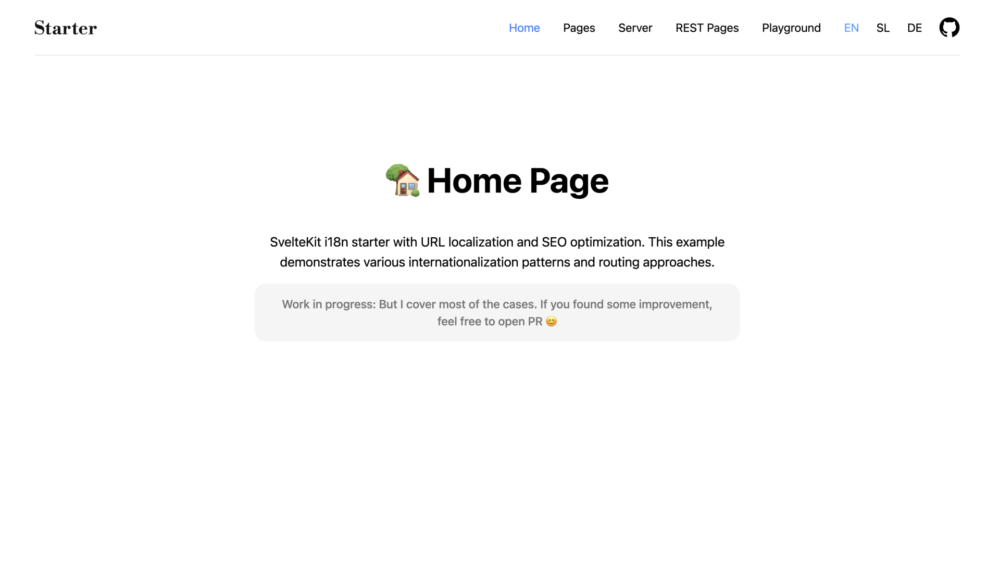

# 🌍 SvelteKit i18n Starter


**Keywords:** `sveltekit` • `svelte` • `i18n` • `internationalization` • `multilingual` • `url localization` • `seo` • `tailwind css`

## 🌐 [Live Demo](https://sveltekit-i18n-starter.klemenc.dev)

URL-driven localization for SvelteKit 2 + Svelte 5. Localized slugs, strict
mapping under `routes/[lang=lang]`, lazy-loaded dictionaries, SEO built in
(hreflang, canonical, sitemap), and a single source of truth for languages —
no i18n runtime dependency.

## 🚀 Features

- **Localized slugs** — data-only mapping in `src/lib/i18n/routes.js`
  (`/pages/query` ↔ `/strani/poizvedba` ↔ `/seiten/abfrage`), with
  `{slug}` and multi-segment `{...rest}` placeholders and
  specificity-aware matching (unit-tested)
- **Reactive translations** — the documented Svelte 5 context-getter
  pattern: language switches update the whole page client-side, no reload
- **Lazy dictionaries** — each language's JSON is its own chunk; visitors
  download only the active language (+ default as missing-key fallback)
- **Language detection** — on `/` only: `lang` cookie → `Accept-Language`
  → default; deep URLs never redirect, so localized URLs stay stable
- **SEO suite** — per-page `<title>`/description via `+page.js`, hreflang
  alternates + `x-default`, canonical URLs, OG/Twitter tags, per-language
  `sitemap.xml`, environment-aware `robots.txt`, 308 canonicalization
  redirects, translated 404 pages
- **Accessible navigation** — keyboard-operable mobile menu
  (`aria-expanded`), focus-visible dropdowns, semantic markup
- **Tooling** — vitest unit tests (routing, negotiation), eslint,
  prettier, GitHub Actions CI
- Playground pages: `/playground/api` and `/playground/i18n`



## ⚡ Quick Start

```bash
pnpm install
pnpm dev
```

That's it — the starter runs without any configuration.

### Configure env (optional)

Environment variables are read via `$env/dynamic/*` with safe defaults, so
`.env` is genuinely optional:

```bash
cp .env.example .env
```

| Variable                       | Default | Purpose                                                      |
| ------------------------------ | ------- | ------------------------------------------------------------ |
| `PUBLIC_DEFAULT_LOCALE`        | `en`    | Language served at `/`                                       |
| `PUBLIC_PREFIX_DEFAULT_LOCALE` | `false` | `true` → default language also lives under `/<lang>`         |
| `PRODUCTION_DOMAIN`            | —       | Exact host that gets the production (allow-all) `robots.txt` |

## 🌐 URL Model

- Default language lives at root (`/`) by default; other languages under
  `/<lang>/…` (`/sl/…`, `/de/…`).
- Prefix mode (`PUBLIC_PREFIX_DEFAULT_LOCALE=true`) puts the default
  language under `/<lang>` too.
- Only the `routes/[lang=lang]` branch is localized. Root-level endpoints
  (`/robots.txt`, `/sitemap.xml`, `/external`, `/favicon.ico`) are never
  redirected or blocked by i18n logic.

Redirects & detection:

| Request                         | Behavior                                                             |
| ------------------------------- | -------------------------------------------------------------------- |
| `/` (first visit)               | 302 to the negotiated language (`lang` cookie → `Accept-Language`)   |
| `/en/pages` (prefix mode OFF)   | 308 to `/pages` (query preserved)                                    |
| `/pages` (prefix mode ON)       | 308 to `/en/pages`                                                   |
| `/sl/pages/query`               | 404 — canonical slugs are invalid where a localized mapping exists   |
| `/strani/poizvedba` (under `/`) | 404 — foreign localized slugs are invalid under the default language |

The `lang` cookie is refreshed on every localized page view, so switching
languages in the navbar is remembered on the next visit to `/`.

## 📁 Files & Responsibilities

- `src/lib/i18n/languages.js` — `LANGUAGES` metadata and derived
  `SUPPORTED_LANGS`. **Single place to add/remove languages.**
- `src/lib/i18n/routes.js` — `ROUTE_SLUGS`, the data-only slug map. Keys
  are canonical (EN) paths, values are localized paths per language; omit
  languages whose slug equals the canonical.
- `src/lib/i18n/routing.js` — pure routing helpers, precompiled per
  language:
    - `toLocalized(path, lang)` / `toCanonical(path, lang)` — preserve
      placeholder values, remainder segments and query/hash; decode
      percent-encoded paths (non-ASCII slugs like `/über-uns` work)
    - `isValidLocalizedPath(path, lang)` — round-trip validation +
      foreign-slug rejection
    - `switchLanguageUrl(currentHref, fromLang, toLang)` — language
      switcher preserving query/hash
    - `compareRouteSpecificity(a, b)` — static > `{slug}` > `{...rest}`,
      longer shapes first (see Route Mapping Rules)
- `src/lib/i18n/i18n.js` — dictionaries and the reactive context:
    - `loadDict(lang)` — lazy per-language dictionary (own Vite chunk),
      deep-merged over the default language as fallback
    - `setI18nContext(getLang, getDict)` — called once in the root layout
    - `useT()` / `useTranslatePath()` / `useI18n()` — component APIs
      (fetch at init, call in templates; reactive to language changes)
    - `translatePathFor(path, lang)` / `makeT(dict)` — explicit-language
      variants, safe in event handlers and on the server
- `src/lib/i18n/negotiate.js` — `negotiateLanguage(header, supported)`,
  pure `Accept-Language` parsing (q-values, region collapse)
- `src/hooks.js` — universal `reroute`: maps localized URLs onto the
  canonical `[lang=lang]` pages; exports the known-page helpers reused by
  the redirects and the sitemap
- `src/hooks.server.js` — language resolution, detection on `/`,
  canonicalization redirects, `lang` cookie, `locals.{lang,intlLocale,t}`,
  `<html lang>` via `transformPageChunk`
- `src/routes/+layout.server.js` → `{ lang, intlLocale }`;
  `src/routes/+layout.js` → attaches the lazy `dict`
- `src/routes/+layout.svelte` — installs the i18n context and renders the
  single SEO head (title/description from each page's `seoKey`, hreflang,
  canonical, OG/Twitter)
- `src/routes/[lang=lang]/+layout.server.js` — localized-path validation
  (a 404 here renders the translated `+error.svelte`, unlike errors
  thrown in `handle`)
- `src/routes/sitemap.xml/+server.js` — per-language sitemap with
  hreflang alternates; `src/routes/robots.txt/+server.js` — serves the
  allow-all file only on the exact `PRODUCTION_DOMAIN` host

## 🧭 Route Mapping Rules

- Placeholders are in braces and always span a full segment:
    - single segment: `/pages/{slug}` ↔ `/strani/{slug}`
    - multi-segment: `/rest/{...rest}/last` ↔ `/poljubno/{...rest}/zadnje`
- **Matching precedence is by specificity, not string length**: static
  segments beat `{slug}`, `{slug}` beats `{...rest}`, and longer shapes
  beat their prefixes. So `/pages/query` → `/strani/poizvedba` even
  though `/pages/{slug}` also matches, and `/rest/dynamic` overrides
  `/rest/{...rest}`.
- Both sides of an entry must use the same placeholder names.
- Default language (prefix OFF) lives at root with canonical slugs;
  foreign localized slugs 404 there. Non-default languages are served
  only under `/<lang>/…`; canonical forms 404 wherever a localized
  mapping exists.

## 🔗 Usage

Translating text and building links in components:

```svelte
<script>
    import { useT, useTranslatePath } from "$i18n/i18n";

    const t = useT();
    const translatePath = useTranslatePath();
</script>

<h1>{t("home.h1")}</h1>
<p>{t("footer.made", { what: "SvelteKit" })}</p>

<a href={translatePath("/pages/query")}>Query demo</a>
```

`useT()`/`useTranslatePath()` must be called during component init (they
read Svelte context); the returned functions are stable and reactive — call
them anywhere, including event handlers.

Explicit language (no context needed):

```svelte
<script>
    import { goto } from "$app/navigation";
    import { translatePathFor, switchLanguageUrl } from "$i18n/i18n";
    import { page } from "$app/state";
</script>

<button onclick={() => goto(translatePathFor("/pages/simple", "sl"))}>
    Open Slovenian page
</button>

<!-- language switcher (preserves query + hash) -->
<a
    href={switchLanguageUrl(
        page.url.pathname + page.url.search,
        undefined,
        "sl"
    )}
>
    SL
</a>
```

Server-side (`locals` is set for all endpoints and server loads):

```js
import { json } from "@sveltejs/kit";

/** @type {import('./$types').RequestHandler} */
export function GET({ locals }) {
    return json({
        lang: locals.lang,
        intlLocale: locals.intlLocale,
        title: locals.t("home.head.title"),
    });
}
```

## 🔍 SEO

Each page declares its metadata in a tiny `+page.js`:

```js
/** @type {import('./$types').PageLoad} */
export function load() {
    return { seoKey: "pageSimple" }; // add `noindex: true` to opt out
}
```

The root layout renders one `<title>`/description pair from
`<seoKey>.head.*` in the active language, plus canonical, hreflang
alternates (`en`/`sl`/`de` + `x-default`), OG and Twitter tags.
`sitemap.xml` lists every static localized page with hreflang alternates,
and `robots.txt` only allows crawling on the configured production host —
previews and staging stay unindexed.

## ➕ Add a Language

1. Add the code, label and locales in `src/lib/i18n/languages.js`.
2. Add translations under `src/lib/locales/<lang>/*.json` (any number of
   files; they are deep-merged, and missing keys fall back to the default
   language).
3. Optional: add localized slugs in `src/lib/i18n/routes.js`.

## 📄 Add a Localized Page

1. Create the page under `src/routes/[lang=lang]/…` with a `+page.js`
   declaring its `seoKey`, and add the matching `<seoKey>.head.*` keys to
   the locale files.
2. If the slugs should differ per language, add entries to `ROUTE_SLUGS`:

```js
export const ROUTE_SLUGS = {
    sl: {
        "/pages": "/strani",
        "/pages/{slug}": "/strani/{slug}",
    },
};
```

3. Link it with `translatePath("/pages")` — prefixes and localized slugs
   are applied automatically.

## 🧪 Tests, Lint & Playgrounds

```bash
pnpm test     # vitest — slug matching, validation, Accept-Language parsing
pnpm check    # svelte-check (strict, checkJs)
pnpm lint     # prettier --check + eslint
pnpm format   # prettier --write
```

CI (GitHub Actions) runs lint → check → test → build on every push/PR.

Interactive helpers:

- **API Sandbox** `/playground/api` — call the localized `+server.js`
  endpoints (GET/POST, translated responses via `locals.t`)
- **i18n Playground** `/playground/i18n` — inspect `toCanonical`,
  `toLocalized`, `isValidLocalizedPath` and prefixing live

## 🛠️ Development & Build

```bash
pnpm dev            # start dev server
pnpm build          # build for production
pnpm preview        # preview built app
```

Adapter: `@sveltejs/adapter-auto` (serverless — Vercel/Netlify/Cloudflare
etc.). The i18n redirects, validation, detection and dynamic
robots/sitemap run at request time, so this starter needs a server
runtime — it is **not** a static-site generator. If you must prerender,
you'll need to rethink the redirect/validation layer.

## ℹ️ Design Notes

- `src/lib/i18n/routes.js` is data-only: no Svelte imports, no logic.
- Language detection happens **only** on `/`; every other URL is stable
  and crawler-friendly. Delete the detection block in
  `src/hooks.server.js` if you want pure URL-driven language selection.
- Links are built by the i18n helpers rather than SvelteKit's `resolve()`
  — this starter doesn't use a base path. Re-enable the
  `svelte/no-navigation-without-resolve` eslint rule if yours does.
- The `/external` route demonstrates a page outside `[lang=lang]` driving
  its own translator with `loadDict`/`makeT`.
- Looking for a batteries-included alternative? The official
  [`sv add paraglide`](https://svelte.dev/docs/cli/paraglide) integration
  offers compiled, type-safe messages. This starter exists for the
  opposite trade-off: fully transparent, dependency-free localized
  routing you can read end-to-end.
